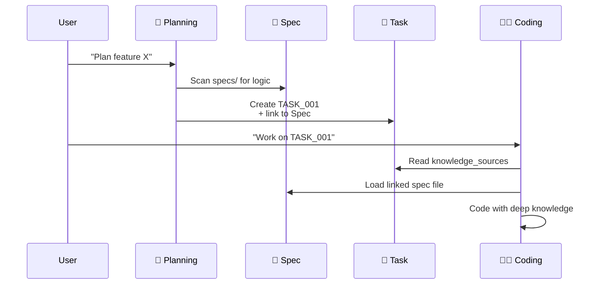

# 🤖 Cursor Rules Agent v0.1.0
**AI-Driven Development Workflow with Knowledge-Aware & Deterministic Architecture**

## 📑 Table of Contents
- [Introduction](#introduction)
- [System Architecture](#system-architecture)
- [System Requirements](#system-requirements)
- [Installation Guide](#installation-guide)
- [Workflow Operations](#workflow-operations)
- [Cursor Agent & Rules](#cursor-agent--rules)
- [Enhanced MCP Tools](#enhanced-mcp-tools)
- [Extensions & Customization](#extensions--customization)
- [Documentation References](#documentation-references)
- [Contributing](#contributing)
- [License](#license)

## 🎯 Introduction

**Cursor Rules Agent** is an AI-driven workflow system that transforms Cursor Agent into a true technical partner in software development. The system not only manages tasks but also **manages and links deep project knowledge** automatically and intelligently.

### Problems Solved

| Before | With Cursor Rules Agent |
|--------|------------------------|
| ❌ Users must write detailed tasks manually | ✅ AI automatically decomposes features into meaningful tasks |
| ❌ AI lacks business context | ✅ Direct linking of tasks with specification documents |
| ❌ Large context, token waste | ✅ Super-optimized context (lazy loading) |
| ❌ Rules loaded by guesswork | ✅ Deterministic logic identifies exactly 1 mode |
| ❌ Docs always out-of-sync | ✅ Docs auto-sync from task progress |

## 🏗️ System Architecture

### 4 Core Pillars

1. **Hierarchy & Knowledge Linking**
   - Blueprints: Architectural design templates for features
   - Task-index: Manages Feature → Tasks structure
   - Knowledge sources: Direct linking between tasks and detailed specs

2. **Deterministic Mode Detection**
   - Master Orchestrator identifies exactly 1 active mode
   - No more context confusion from multiple modes

3. **Context-Aware Loading**
   - Context Loader intelligently loads information based on mode
   - Highest priority for task's knowledge sources

4. **Task Granularity Principle**
   - Each task is a "Significant Unit of Work" (3-8 story points)
   - Clear testable outcomes

### Directory Structure

```
cursor-rules-agent/
├── .cursor/rules/              # Place all rules here when using
├── knowledge/                  # Documentation about Cursor Agent & Rules
│   ├── cursor-agent.md
│   └── cursor-rules.md
├── src/                        # Workflow system source code
│   ├── core/                   # Core orchestration rules
│   │   ├── master-orchestrator.mdc
│   │   └── context-loader.mdc
│   ├── modes/                  # Operating modes
│   │   ├── initializing-mode.mdc
│   │   ├── brainstorming-mode.mdc
│   │   ├── planning-agent.mdc
│   │   ├── developing-mode.mdc
│   │   └── documenting-mode.mdc
│   ├── utilities/              # Support tools
│   │   ├── safe-code-generation.mdc
│   │   └── enforcer.mdc
│   └── templates/              # Standard templates
├── USER_RULES_TEMPLATE.md      # Template for Cursor User Rules setup
└── README.md                   # This file
```

## ⚙️ System Requirements

- **Cursor IDE** latest version
- **Git** for version control
- File create/edit permissions in project directory
- Internet connection (for Cursor Agent)
- **MCP Tools** (optional but recommended for enhanced capabilities)

## 🚀 Installation Guide

### ⚡ Super Quick Setup (1 minute) - Recommended

**Using NPX (No installation needed):**
```bash
cd your-project
npx cursor-rules-agent-installer
```

That's it! The installer will:
- ✅ Create `.cursor/rules/` with all workflow rules
- ✅ Set up organized project structure (`docs/specs/`, `docs/features/`, `blueprints/`)
- ✅ Initialize `task-index.json` for task management
- ✅ Provide User Rules template for Cursor Settings
- ✅ Guide you through first steps

### ⚡ Git Installation (Alternative)

**Install directly from GitHub:**
```bash
cd your-project
npm install https://github.com/khanhbkqt/cursor-rules-agent.git
npx cursor-rules-agent-installer
```

### 🛠️ Manual Setup (Advanced)

<details>
<summary>Click to expand manual installation steps</summary>

1. **Copy rules to your project**:
   ```bash
   # Create rules directory in project
   mkdir -p .cursor/rules/{core,modes,utilities,templates}
   
   # Copy all content from src/ to .cursor/rules/
   cp -r path/to/cursor-rules-agent/src/* .cursor/rules/
   ```

2. **Setup User Rules** (Personal Preferences):
   - Open Cursor Settings > Rules
   - Copy content from [`USER_RULES_TEMPLATE.md`](USER_RULES_TEMPLATE.md) to your User Rules
   - Customize communication style and preferences to your liking

3. **Bootstrap project structure**:
   ```bash
   mkdir -p docs/{specs,features} blueprints
   ```

4. **Create task-index.json**:
   ```json
   {
     "project": { "name": "your-project", "version": "1.0.0" },
     "features": {}, "tasks": {}, "completed": {},
     "statistics": { "total_tasks": 0, "completed_tasks": 0 }
   }
   ```
</details>

### 🎯 After Installation

Open Cursor in your project and try:
```
"bootstrap project structure"
```
Then:
```
"Plan feature: User Authentication"
```

### 🤖 Smart Features

- **Auto-generate rules**: `"Generate rule for consistent API error responses"`
- **Self-optimize**: `"Analyze my code and suggest project-specific rules"`
- **Mode detection**: System automatically switches between modes based on your requests

## 🔄 Workflow Operations

### Knowledge-Aware Workflow



### Detailed Workflow Steps

1. **Brainstorming** (Optional):
   ```
   "start brainstorming for new e-commerce features"
   ```
   - Collect and filter ideas using enhanced MCP tools
   - Create Idea Backlog with RICE analysis
   - Leverage web search and library research for inspiration

2. **Planning**:
   ```
   "Plan feature: Shopping Cart"
   ```
   - Create Blueprint if not exists
   - Decompose into meaningful tasks
   - Link with knowledge sources

3. **Developing**:
   ```
   "Start working on TASK_001"
   ```
   - Agent loads related specs
   - Code with the **RMWV + Surgical Edit** safety pattern to ensure precise and safe file modifications.
   - Real-time progress updates

4. **Documenting**:
   ```
   "Update documentation for completed features"
   ```
   - Sync API docs
   - Update architecture diagrams
   - Mark implemented ideas

## 🤖 Cursor Agent & Rules

### What is Cursor Agent?

[Cursor Agent](knowledge/cursor-agent.md) is the heart of Cursor's conversation experience - an AI assistant with capabilities:
- Understand → Plan → Act
- Read/write files, search codebase
- Look up docs, search web
- Execute terminal commands

### How do Cursor Rules work?

[Cursor Rules](knowledge/cursor-rules.md) teach the Agent project-specific rules through various types:

1. **Project Rules** (`.mdc` files):
   - Always Apply: `alwaysApply: true`
   - Auto Attached: `globs: ["src/**/*.ts"]`
   - Agent Requested: Based on `description`
   - Manual: Called with `@rule-name`

2. **Mode-specific Rules**:
   - Planning Mode → planning-agent.mdc
   - Developing Mode → developing-mode.mdc + safe-code-generation.mdc
   - Documenting Mode → documenting-mode.mdc

3. **Triggered Utilities**:
   - safe-code-generation: Enforces the **RMWV + Surgical Edit** pattern for safe code modifications, based on [Gemini 2.5 Pro best practices](https://forum.cursor.com/t/gemini-2-5-pro-06-05-has-issues-with-edit-reapply/101373/10).
   - enforcer: Blueprint gate enforcement

## 🔧 Enhanced MCP Tools

### Core MCP Tools Integration

Our workflow leverages advanced MCP (Model Context Protocol) tools to enhance AI capabilities:

#### 1. **Web Search Tool** 🌐
- **Purpose**: Real-time internet research for current best practices
- **Usage in Brainstorming**: Research latest trends, technologies, and solutions
- **Usage in Planning**: Validate architectural decisions against industry standards
- **Usage in Developing**: Find code examples and troubleshooting solutions

#### 2. **Context7 MCP** 📚
- **Purpose**: Access comprehensive library documentation and APIs
- **Usage in Brainstorming**: Explore available libraries for feature implementation
- **Usage in Planning**: Validate technology choices and dependencies
- **Usage in Developing**: Get precise API documentation and code examples

#### 3. **Sequential Thinking** 🧠
- **Purpose**: Enable deep, structured reasoning for complex problems
- **Usage in Brainstorming**: Systematic idea generation and evaluation
- **Usage in Planning**: Thorough task decomposition and dependency analysis
- **Usage in Developing**: Complex algorithm design and debugging

#### 4. **Interactive MCP** 💬
- **Purpose**: Real-time user input without breaking thought flow
- **Usage in All Modes**: Clarify requirements, confirm decisions, get feedback
- **Usage in Brainstorming**: Validate ideas and priorities with stakeholders
- **Usage in Planning**: Confirm task breakdown and acceptance criteria

### Mode-Specific Tool Usage

#### Brainstorming Mode Enhanced
```
"brainstorm AI-powered customer service features"
```
The agent will:
1. Use **Sequential Thinking** to structure the ideation process
2. Use **Web Search** to research current AI customer service trends
3. Use **Context7** to explore relevant AI/ML libraries
4. Use **Interactive MCP** to validate ideas with you in real-time
5. Generate comprehensive idea backlog with feasibility analysis

#### Planning Mode Enhanced
```
"Plan feature: Real-time Chat System"
```
The agent will:
1. Use **Context7** to research WebSocket/real-time libraries
2. Use **Web Search** to find architectural best practices
3. Use **Sequential Thinking** for systematic task breakdown
4. Use **Interactive MCP** to confirm technical decisions

#### Developing Mode Enhanced
```
"Implement TASK_005: WebSocket Message Handler"
```
The agent will:
1. Use **Context7** for precise API documentation
2. Use **Sequential Thinking** for complex implementation logic
3. Use **Interactive MCP** for quick clarifications and save Agent requests
4. Apply **Safe Code Generation** with the **RMWV + Surgical Edit** pattern for precise, reliable code changes.

## 🔧 Extensions & Customization

### Adding New Modes

1. Create `.mdc` file in `modes/`
2. Update detection logic in `master-orchestrator.mdc`
3. Add mapping in `context-loader.mdc`

### Adding New Utilities

1. Create file in `utilities/`
2. Define trigger conditions
3. Update context-loader to load when needed

### Customizing Templates

- Modify `blueprint-template.yaml` to team standards
- Update `task-template.md` with additional fields
- Add validation rules in `enforcer.mdc`

### MCP Tool Configuration

- Configure web search preferences for your domain
- Set up Context7 for your preferred libraries
- Customize Interactive MCP prompts for your workflow
- Tune Sequential Thinking depth for project complexity

## 📚 Documentation References

### Detailed Documentation
- [Cursor Agent Documentation](knowledge/cursor-agent.md) - Deep dive into Cursor Agent
- [Cursor Rules Documentation](knowledge/cursor-rules.md) - Master the Cursor Rules system
- [Complete Guide](src/GUIDE.md) - Step-by-step detailed guide
- [System README](src/README.md) - Technical workflow details

### Best Practices
- **Specs first, code second**: Spec quality determines code quality
- **One spec, one purpose**: Focus on one business aspect
- **Review task-index regularly**: Ensure accurate progress tracking
- **Use blueprint gates**: Quality control through phases
- **Leverage MCP tools**: Use appropriate tools for each phase

## 🤝 Contributing

We welcome all contributions! The system is designed for easy extension:

1. Fork repository
2. Create feature branch (`git checkout -b feature/AmazingFeature`)
3. Commit changes (`git commit -m 'Add AmazingFeature'`)
4. Push to branch (`git push origin feature/AmazingFeature`)
5. Open Pull Request

### Contribution Guidelines
- All new rules must have clear documentation
- Test thoroughly before submitting PR
- Follow current .mdc format
- Update README if adding new features
- Include MCP tool integration examples when relevant

## 📄 License

This project is distributed under the MIT License. See the [LICENSE](LICENSE) file for more details.

---

> 💡 **Core Philosophy**: Transform AI from a command executor into a partner capable of **understanding and utilizing deep project knowledge** automatically and efficiently.

**Version**: 0.1.0 (First Release)  
**Repository**: https://github.com/khanhbkqt/cursor-rules-agent  
**Last Updated**: January 2025

### 🚀 Quick Links
- [Installation Guide](#installation-guide) - Get started in 5 minutes
- [Enhanced MCP Tools](#enhanced-mcp-tools) - Leverage advanced AI capabilities
- [Complete Guide](src/GUIDE.md) - Full step-by-step documentation
- [Cursor Agent](knowledge/cursor-agent.md) - Understanding the AI assistant
- [Cursor Rules](knowledge/cursor-rules.md) - Mastering the rules system 