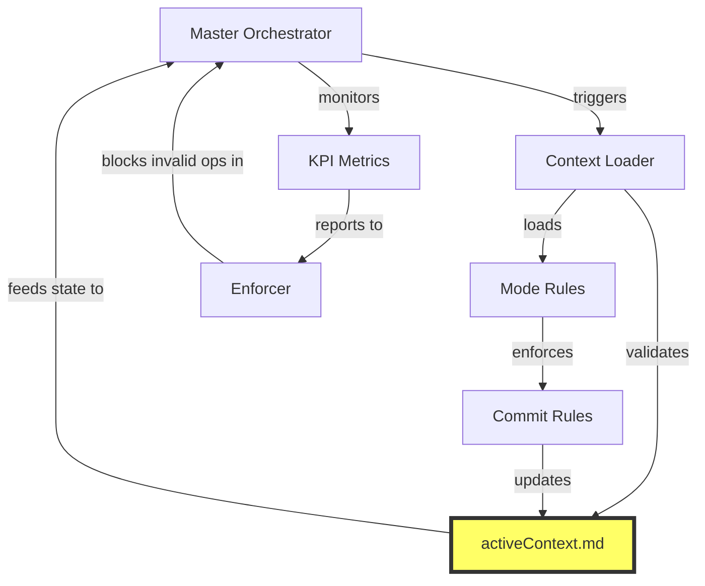

# 🤖 Cursor Rules Agent v0.3.1
**AI-Driven Development Workflow with Enforced Best Practices & Cross-Reference System**

## 📑 Table of Contents
- [Quick Start](#quick-start)
- [What's New in v0.3.1](#whats-new-in-v031)
- [What's New in v0.3](#whats-new-in-v03)
- [Introduction](#introduction)
- [System Architecture](#system-architecture)
- [System Requirements](#system-requirements)
- [Installation Guide](#installation-guide)
- [Workflow Operations](#workflow-operations)
- [Workflow Enforcement & KPIs](#workflow-enforcement--kpis)
- [Bug Fixing Workflow](#bug-fixing-workflow)
- [Cursor Agent & Rules](#cursor-agent--rules)
- [Enhanced MCP Tools](#enhanced-mcp-tools)
- [MCP Server Installation Guide](#️-mcp-server-installation-guide)
- [Extensions & Customization](#extensions--customization)
- [Documentation References](#documentation-references)
- [Contributing](#contributing)
- [License](#license)

## 🆕 What's New in v0.3.1

### 📊 **KPI Metrics & Compliance System**
- **100% Compliance Enforcement**: Binary pass/fail criteria for all workflow steps
- **Real-time Monitoring**: Dashboard with workflow compliance, context sync, and commit coverage metrics
- **Automated Violation Detection**: Immediate halt and remediation for any rule violations
- **Success Metrics**: 7-day rolling compliance average, zero critical violations target

### 🔗 **Cross-Reference Integration System**
- **Zero Isolated Operations**: Every component integrated through mandatory cross-references
- **3 Reinforcement Loops**: Context sync, compliance validation, and mode transition loops
- **Circular Verification**: Each step validates previous outputs, ensuring consistency
- **Dependency Graph**: Visual mapping of all component interactions

### 🚨 **Enhanced Rule Enforcement**
- **MANDATORY Language**: Upgraded all rules to use prescriptive language (MUST, SHALL, REQUIRED)
- **Visual Hierarchy**: Critical sections highlighted with emojis and formatting
- **Violation Protocols**: Immediate halt, remediation, and audit logging
- **activeContext.md Enforcement**: Required updates on every status change

### 🛡️ **Workflow Best Practices**
- **Follows Industry Standards**: Based on Gemini 2.5 Pro and best AI enforcement patterns
- **Self-Verification Systems**: Automated compliance checks before user responses
- **Measurable Outcomes**: All rules have binary success criteria
- **Integration Points**: Every component has defined inputs, outputs, and validations

## 🆕 What's New in v0.3

### 🧠 **Structured Brainstorming System**
- **Organized Documentation**: Feature-based folder structure `docs/ideas/[feature-name]/` with 4 core files
- **Research-Driven**: Systematic market research, technology analysis, and risk assessment
- **MCP Tools Integration**: Enhanced brainstorming with Web Search, Context7, Sequential Thinking, and Interactive MCP
- **Planning Handoff**: Seamless transition from brainstorming to planning with comprehensive summary packages

### 🔄 **Complete Workflow Integration**
- **Mode Synchronization**: All modes (Brainstorming → Planning → Developing → Documenting) work together seamlessly
- **Context Awareness**: Each mode understands and uses outputs from previous modes
- **Technology Consistency**: Brainstorming recommendations flow through planning to development
- **Risk-Aware Development**: Risk mitigation strategies from brainstorming are implemented as tasks

### 📚 **Enhanced Documentation Templates**
- **Simple Templates**: 4 core files per feature - requirements, research, analysis, summary
- **Structured Organization**: Clear folder hierarchy for better knowledge management
- **Cross-Mode References**: Documentation links between brainstorming, planning, and development phases
- **Knowledge Accumulation**: Reusable insights for future features

### 🛠 **MCP Tools Enhancement**
- **Comprehensive Research**: Web search for market trends and competitive analysis
- **Technology Validation**: Context7 integration for library and framework research
- **Structured Analysis**: Sequential thinking for systematic evaluation and prioritization
- **Real-time Validation**: Interactive MCP for stakeholder feedback during brainstorming

## 🆕 What's New in v0.2

### 🐞 **Comprehensive Bug Fixing Workflow**
- **Automatic Bug-Fixing Mode**: System automatically switches to bug-fixing mode when critical issues are detected
- **Emergency Hotfix Protocol**: Special workflow for blocker-severity bugs with immediate response
- **Structured Bug Tracking**: Complete bug lifecycle management with severity levels and response times
- **Git Integration**: Automated branch creation and structured commit messages for bug fixes

### 🎯 **Enhanced Mode Detection**
- **Improved Logic**: More accurate and deterministic mode identification
- **Better Context Understanding**: Enhanced ability to understand user intent and switch modes appropriately
- **Refined Master Orchestrator**: Updated algorithms for precise mode detection

### 🔧 **Unified Commit Rules**
- **Standardized Git Workflow**: Consistent commit message formatting across all modes
- **Branch Naming Conventions**: Proper prefixes for different types of work (feat/, bugfix/, hotfix/)
- **Structured Commits**: Clear commit descriptions with fixes and testing information

### ⚡ **Enhanced Installer**
- **GitHub Integration**: Files downloaded directly from repository ensuring always up-to-date content
- **Reliable Downloads**: Retry mechanism with error handling for network issues
- **Complete Content**: All rules, templates, and utilities included (no more embedded/incomplete content)
- **Faster Setup**: Streamlined installation process with better user feedback

### 📚 **Documentation Improvements**
- **Complete Bug Workflow Guide**: Detailed documentation for bug detection and resolution
- **Emergency Protocols**: Clear procedures for handling critical issues
- **Enhanced Examples**: More comprehensive examples and use cases

## ⚡ Quick Start

Get started in 30 seconds with NPX:

```bash
npx cursor-rules-agent-installer
```

Then open Cursor and say: `"initialize project structure"`

## 🎯 Introduction

**Cursor Rules Agent** is an AI-driven workflow system that transforms Cursor Agent into a true technical partner in software development. The system not only manages tasks but also **manages and links deep project knowledge** automatically and intelligently.

### Problems Solved

| Before | With Cursor Rules Agent |
|--------|------------------------|
| ❌ Users must write detailed tasks manually | ✅ AI automatically decomposes features into meaningful tasks |
| ❌ AI lacks business context | ✅ Direct linking of tasks with specification documents |
| ❌ Large context, token waste | ✅ Super-optimized context (lazy loading) |
| ❌ Rules loaded by guesswork | ✅ Deterministic logic identifies exactly 1 mode |
| ❌ Docs always out-of-sync | ✅ Docs auto-sync from task progress |

## 🏗️ System Architecture

### 4 Core Pillars

1. **Hierarchy & Knowledge Linking**
   - Blueprints: Architectural design templates for features
   - Task-index: Manages Feature → Tasks structure
   - Knowledge sources: Direct linking between tasks and detailed specs

2. **Deterministic Mode Detection**
   - Master Orchestrator identifies exactly 1 active mode
   - No more context confusion from multiple modes

3. **Context-Aware Loading**
   - Context Loader intelligently loads information based on mode
   - Highest priority for task's knowledge sources

4. **Task Granularity Principle**
   - Each task is a "Significant Unit of Work" (3-8 story points)
   - Clear testable outcomes

### Directory Structure

```
cursor-rules-agent/
├── .cursor/rules/              # Place all rules here when using
├── knowledge/                  # Documentation about Cursor Agent & Rules
│   ├── cursor-agent.md
│   └── cursor-rules.md
├── src/                        # Workflow system source code
│   ├── core/                   # Core orchestration rules
│   │   ├── master-orchestrator.mdc
│   │   └── context-loader.mdc
│   ├── modes/                  # Operating modes
│   │   ├── initializing-mode.mdc
│   │   ├── brainstorming-mode.mdc   # Enhanced: Structured brainstorming
│   │   ├── planning-agent.mdc       # Enhanced: Brainstorming integration
│   │   ├── developing-mode.mdc      # Enhanced: Context-aware development
│   │   ├── bug-fixing-mode.mdc      # Priority bug resolution
│   │   └── documenting-mode.mdc     # Enhanced: Insight preservation
│   ├── utilities/              # Support tools
│   │   ├── safe-code-generation.mdc
│   │   ├── enforcer.mdc
│   │   ├── commit-rules.mdc         # Auto-commit integration
│   │   ├── kpi-metrics.mdc          # NEW: Compliance metrics
│   │   └── cross-reference-system.mdc # NEW: Integration map
│   └── templates/              # Standard templates
│       ├── idea-requirements-template.md     # NEW: Brainstorming templates
│       ├── idea-research-template.md         # NEW: Research template
│       ├── idea-analysis-template.md         # NEW: Analysis template
│       ├── idea-summary-template.md          # NEW: Handoff template
│       └── ideas-readme-template.md          # NEW: Documentation guide
├── bugs/                       # Bug tracking & resolution
│   ├── templates/
│   │   └── bug-report-template.md
│   └── bug-index.json
├── docs/                       # Project documentation (created during use)
│   ├── ideas/                  # NEW: Brainstorming documentation
│   │   └── [feature-name]/     # Feature-specific brainstorming
│   │       ├── requirements.md # User needs & stakeholder input
│   │       ├── research.md     # Market & technology research
│   │       ├── analysis.md     # Risk assessment & prioritization
│   │       └── summary.md      # Planning handoff package
│   ├── features/               # Feature documentation
│   ├── blueprints/             # Architectural blueprints
│   └── tasks/                  # Task management
├── USER_RULES_TEMPLATE.md      # Template for Cursor User Rules setup
└── README.md                   # This file
```

## ⚙️ System Requirements

- **Cursor IDE** latest version
- **Git** for version control
- File create/edit permissions in project directory
- Internet connection (for Cursor Agent)
- **MCP Tools** (optional but recommended for enhanced capabilities)

## 🚀 Installation Guide

### ⚡ One-Command Installation (Recommended)

Install and set up Cursor Rules Agent in any project with a single command:

```bash
npx cursor-rules-agent-installer
```

**That's it!** No global installation needed. The installer will:
- ✅ **Download latest rules from GitHub** (always up-to-date content)
- ✅ Create `.cursor/rules/` with all workflow rules
- ✅ **Reliable installation** with retry mechanism and error handling  
- ✅ Provide User Rules template for Cursor Settings
- ✅ Guide you through first steps

### 🎯 Why NPX?
- **No global installs**: Use latest version every time
- **Always up-to-date**: Rules downloaded directly from GitHub
- **Zero dependencies**: No need to manage package versions
- **Works anywhere**: Any project, any directory

> **📦 Package Name**: `cursor-rules-agent-installer` on NPM

**Note**: The installer focuses only on Cursor Rules installation. For project structure setup, use the command `"initialize project structure"` after installation.

### 📦 Alternative Installation Methods

<details>
<summary>🔧 Advanced Installation Options</summary>

**For development or custom setups:**

1. **Git Installation:**
```bash
npm install https://github.com/khanhbkqt/cursor-rules-agent.git
npx cursor-rules-agent-installer
```

2. **Global Installation (not recommended):**
```bash
npm install -g cursor-rules-agent-installer
cursor-rules-agent-installer
```

**Recommendation**: Use NPX for the best experience - it's simpler and always uses the latest version.

</details>

### 🛠️ Manual Setup (Advanced)

<details>
<summary>Click to expand manual installation steps</summary>

1. **Copy rules to your project**:
   ```bash
   # Create rules directory in project
   mkdir -p .cursor/rules/{core,modes,utilities,templates}
   
   # Copy all content from src/ to .cursor/rules/
   cp -r path/to/cursor-rules-agent/src/* .cursor/rules/
   ```

2. **Setup User Rules** (Personal Preferences):
   - Open Cursor Settings > Rules
   - Copy content from [`USER_RULES_TEMPLATE.md`](USER_RULES_TEMPLATE.md) to your User Rules
   - Customize communication style and preferences to your liking

3. **Bootstrap project structure**:
   ```bash
   mkdir -p docs/{specs,features} blueprints
   ```

4. **Create task-index.json**:
   ```json
   {
     "project": { "name": "your-project", "version": "1.0.0" },
     "features": {}, "tasks": {}, "completed": {},
     "statistics": { "total_tasks": 0, "completed_tasks": 0 }
   }
   ```
</details>

### 🎯 After NPX Installation

1. **Open Cursor in your project directory**
2. **Initialize project structure** (required first step):
```
"initialize project structure"
```

3. **Start using the enhanced AI workflow**:
```
"What mode should I be in?"
```

**📖 For complete step-by-step guidance, see [QUICKSTART.md](QUICKSTART.md)**

Try these enhanced commands:
```
"brainstorm ideas for user authentication system"
"plan feature: Shopping Cart with payment integration"
"work on TASK_001: Implement JWT authentication"
"update documentation for completed features"
```

### 🤖 Smart Features

- **Auto-generate rules**: `"Generate rule for consistent API error responses"`
- **Self-optimize**: `"Analyze my code and suggest project-specific rules"`
- **Mode detection**: System automatically switches between modes based on your requests

## 🔄 Workflow Operations

### Enhanced Knowledge-Aware Workflow

```mermaid
sequenceDiagram
    participant User
    participant Brainstorming as 🧠 Brainstorming
    participant Ideas as 💡 Ideas Docs
    participant Planning as 🤖 Planning
    participant Task as 📝 Task
    participant Coding as 🧑‍💻 Coding

    User->>Brainstorming: "brainstorm e-commerce features"
    Brainstorming->>Ideas: Create docs/ideas/feature-name/<br/>4 files: requirements, research, analysis, summary
    User->>Planning: "plan feature X" (or automatic handoff)
    Planning->>Ideas: Read summary.md + tech recommendations
    Planning->>Task: Create TASK_001 with<br/>brainstorming context
    User->>Coding: "work on TASK_001"
    Coding->>Task: Read knowledge_sources
    Coding->>Ideas: Load brainstorming insights
    Coding->>Coding: Code with complete context
```



### Detailed Workflow Steps

1. **Brainstorming** (Enhanced):
   ```
   "brainstorm AI-powered customer service features"
   ```
   - **Structured Research**: Market analysis, technology exploration, competitive analysis
   - **MCP Tools Integration**: Web search, Context7, Sequential Thinking, Interactive MCP
   - **Organized Documentation**: Creates `docs/ideas/[feature-name]/` with 4 core files:
     - `requirements.md` - User needs and stakeholder input
     - `research.md` - Market trends and technology analysis  
     - `analysis.md` - Risk assessment and prioritization
     - `summary.md` - Final recommendations for Planning handoff

2. **Planning** (Brainstorming-Aware):
   ```
   "plan feature: Shopping Cart"
   ```
   - **Auto-detect brainstorming handoff** from `summary.md`
   - **Use technology recommendations** from brainstorming research
   - **Create risk mitigation tasks** based on brainstorming analysis
   - **Follow implementation phases** suggested by brainstorming
   - Create Blueprint with pre-populated insights
   - Decompose into meaningful tasks with complete context

3. **Developing** (Context-Enhanced):
   ```
   "work on TASK_001"
   ```
   - **Load brainstorming context** with technology recommendations
   - **Follow technology stack** from brainstorming recommendations
   - **Implement risk mitigation** strategies identified during brainstorming
   - Agent loads related specs and knowledge sources
   - Code with the **RMWV + Surgical Edit** safety pattern to ensure precise and safe file modifications
   - Real-time progress updates

4. **Documenting** (Insight-Enriched):
   ```
   "update documentation for completed features"
   ```
   - **Incorporate brainstorming insights** into feature documentation
   - **Reference research findings** and technology analysis
   - **Mark brainstorming sessions** as implemented in summary.md
   - Sync API docs with technology decisions from brainstorming
   - Update architecture diagrams with implemented solutions
   - Create comprehensive feature documentation

## 📊 Workflow Enforcement & KPIs

### 🚨 **100% Compliance Enforcement System**

The Cursor Rules Agent now includes a comprehensive enforcement system that ensures **zero violations** and **100% workflow compliance**:

#### **Real-time KPI Monitoring**

```yaml
Workflow Compliance Metrics:
  - Orchestrator Steps: 100% completion required
  - Context Sync Rate: activeContext.md < 5 min freshness
  - Auto-commit Coverage: 100% on status changes
  - Mode Detection Accuracy: 100% correct identification
  - Violation Count: 0 tolerance
```

#### **Cross-Reference Integration**



#### **3 Reinforcement Loops**

1. **Context Synchronization Loop**
   - Orchestrator → Context Loader → Execution → Commit → activeContext.md → Orchestrator
   - Ensures state consistency across all operations

2. **Compliance Validation Loop**
   - KPI Metrics → Violation Detection → Enforcer → Remediation → Metrics Update
   - Automatic detection and fixing of violations

3. **Mode Transition Loop**
   - Task Completion → Auto-commit → Context Update → Mode Detection → New Mode
   - Seamless workflow transitions with full tracking

#### **Binary Success Criteria**

```markdown
SYSTEM STATUS: [PASS ✅ / FAIL ❌]

Required for PASS:
- [ ] Orchestrator Compliance = 100%
- [ ] Context Sync Rate = 100%
- [ ] Auto-commit Coverage = 100%
- [ ] Active Violations = 0
- [ ] ActiveContext Freshness < 5min

ANY unchecked = SYSTEM FAIL → IMMEDIATE REMEDIATION
```

#### **Violation Handling Protocol**

When any violation is detected:
1. **🛑 HALT**: All operations stop immediately
2. **🔍 IDENTIFY**: System identifies the specific violation
3. **🔄 REMEDIATE**: Automatic fix is applied
4. **✅ VERIFY**: Compliance is re-checked
5. **📝 LOG**: Violation and fix are recorded for audit

#### **Key Benefits**

- **Zero Manual Oversight**: System self-monitors and self-corrects
- **100% Compliance Rate**: Impossible to skip critical steps
- **Complete Audit Trail**: Every operation tracked and verified
- **Predictable Workflows**: Consistent execution every time

## 🐞 Bug Fixing Workflow

### Critical Bug Detection & Resolution

**Cursor Rules Agent** includes a dedicated **Bug-Fixing Mode** that automatically takes priority when critical issues are detected:

#### Automatic Bug-Fixing Mode Activation

The system switches to Bug-Fixing Mode when:
1. **Critical/Blocker bugs** exist in `bugs/bug-index.json` with status `open` or `in-progress`
2. **Failing tests** are detected with critical impact (app crash, data corruption)
3. **Manual trigger**: User types `fix bug` or `hotfix`

#### Bug Workflow Operations

1. **Report Bug**:
   ```
   "There's a memory leak in the orchestrator causing crashes"
   ```
   - Agent creates bug report using template
   - Assigns severity level (blocker, critical, major, minor)
   - Adds to `bugs/bug-index.json` tracking

2. **Bug Fixing Process**:
   ```
   "fix bug BUG-2025-001"
   ```
   - **Step 1**: Create failing test (RED)
   - **Step 2**: Root cause analysis using Sequential Thinking
   - **Step 3**: Implement minimal, safe fix
   - **Step 4**: Validate fix (GREEN)
   - **Step 5**: Add regression test

3. **Git Workflow for Bugs**:
   ```bash
   # Automatic branch creation
   git checkout -b bugfix/BUG-2025-001-memory-leak
   
   # Structured commit messages
   git commit -m "fix(orchestrator): resolve memory leak
   
   Fixes: BUG-2025-001
   Root cause: event listeners not removed
   Testing: added regression test"
   ```

#### Bug Severity Levels

| Severity | Description | Response Time | Branch Type |
|----------|-------------|---------------|-------------|
| **Blocker** | System unusable | Immediate | `hotfix/` |
| **Critical** | Major functionality broken | < 2 hours | `bugfix/` |
| **Major** | Significant feature affected | < 1 day | `bugfix/` |
| **Minor** | Small issues, workarounds exist | Next sprint | `feat/` |

#### Emergency Hotfix Protocol

For **severity: blocker** bugs:
- Uses `hotfix/` branch prefix
- Skips normal review process (direct merge allowed)
- Triggers immediate deployment
- Requires post-fix review within 24h

#### Bug Tracking Structure

```
bugs/
├── templates/
│   └── bug-report-template.md    # Standardized bug reporting
├── bug-index.json                # Central bug tracking
└── YYYY-MM-DD-bug-name.md        # Individual bug reports
```

#### Sample Bug Index Entry
```json
{
  "id": "BUG-2025-001",
  "title": "Memory leak in orchestrator",
  "severity": "critical",
  "status": "resolved",
  "created": "2025-01-15T10:30:00Z",
  "resolved": "2025-01-15T12:45:00Z",
  "commit": "abc123f",
  "branch": "bugfix/BUG-2025-001-memory-leak"
}
```

## 🤖 Cursor Agent & Rules

### What is Cursor Agent?

[Cursor Agent](knowledge/cursor-agent.md) is the heart of Cursor's conversation experience - an AI assistant with capabilities:
- Understand → Plan → Act
- Read/write files, search codebase
- Look up docs, search web
- Execute terminal commands

### How do Cursor Rules work?

[Cursor Rules](knowledge/cursor-rules.md) teach the Agent project-specific rules through various types:

1. **Project Rules** (`.mdc` files):
   - Always Apply: `alwaysApply: true`
   - Auto Attached: `globs: ["src/**/*.ts"]`
   - Agent Requested: Based on `description`
   - Manual: Called with `@rule-name`

2. **Mode-specific Rules**:
   - Planning Mode → planning-agent.mdc
   - Developing Mode → developing-mode.mdc + safe-code-generation.mdc
   - Documenting Mode → documenting-mode.mdc

3. **Triggered Utilities**:
   - safe-code-generation: Enforces the **RMWV + Surgical Edit** pattern for safe code modifications, based on [Gemini 2.5 Pro best practices](https://forum.cursor.com/t/gemini-2-5-pro-06-05-has-issues-with-edit-reapply/101373/10).
   - enforcer: Blueprint gate enforcement

## 🔧 Enhanced MCP Tools

### Core MCP Tools Integration

Our workflow leverages advanced MCP (Model Context Protocol) tools to enhance AI capabilities:

#### 1. **Web Search Tool** 🌐
- **Purpose**: Real-time internet research for current best practices
- **Usage in Brainstorming**: Research latest trends, technologies, and solutions
- **Usage in Planning**: Validate architectural decisions against industry standards
- **Usage in Developing**: Find code examples and troubleshooting solutions

#### 2. **Context7 MCP** 📚
- **Purpose**: Access comprehensive library documentation and APIs
- **Usage in Brainstorming**: Explore available libraries for feature implementation
- **Usage in Planning**: Validate technology choices and dependencies
- **Usage in Developing**: Get precise API documentation and code examples

#### 3. **Sequential Thinking** 🧠
- **Purpose**: Enable deep, structured reasoning for complex problems
- **Usage in Brainstorming**: Systematic idea generation and evaluation
- **Usage in Planning**: Thorough task decomposition and dependency analysis
- **Usage in Developing**: Complex algorithm design and debugging

#### 4. **Interactive MCP** 💬
- **Purpose**: Real-time user input without breaking thought flow
- **Usage in All Modes**: Clarify requirements, confirm decisions, get feedback
- **Usage in Brainstorming**: Validate ideas and priorities with stakeholders
- **Usage in Planning**: Confirm task breakdown and acceptance criteria

### Mode-Specific Tool Usage

#### Brainstorming Mode Enhanced
```
"brainstorm AI-powered customer service features"
```
The agent will:
1. Use **Sequential Thinking** to structure the ideation process
2. Use **Web Search** to research current AI customer service trends
3. Use **Context7** to explore relevant AI/ML libraries
4. Use **Interactive MCP** to validate ideas with you in real-time
5. Generate comprehensive idea backlog with feasibility analysis

#### Planning Mode Enhanced
```
"Plan feature: Real-time Chat System"
```
The agent will:
1. Use **Context7** to research WebSocket/real-time libraries
2. Use **Web Search** to find architectural best practices
3. Use **Sequential Thinking** for systematic task breakdown
4. Use **Interactive MCP** to confirm technical decisions

#### Developing Mode Enhanced
```
"Implement TASK_005: WebSocket Message Handler"
```
The agent will:
1. Use **Context7** for precise API documentation
2. Use **Sequential Thinking** for complex implementation logic
3. Use **Interactive MCP** for quick clarifications and save Agent requests
4. Apply **Safe Code Generation** with the **RMWV + Surgical Edit** pattern for precise, reliable code changes.

## 🔧 Extensions & Customization

### Adding New Modes

1. Create `.mdc` file in `modes/`
2. Update detection logic in `master-orchestrator.mdc`
3. Add mapping in `context-loader.mdc`

### Adding New Utilities

1. Create file in `utilities/`
2. Define trigger conditions
3. Update context-loader to load when needed

### Customizing Templates

- Modify `blueprint-template.yaml` to team standards
- Update `task-template.md` with additional fields
- Add validation rules in `enforcer.mdc`

### MCP Tool Configuration

- Configure web search preferences for your domain
- Set up Context7 for your preferred libraries
- Customize Interactive MCP prompts for your workflow
- Tune Sequential Thinking depth for project complexity

### 🛠️ MCP Server Installation Guide

To fully leverage Cursor Rules Agent's enhanced capabilities, install these recommended MCP servers:

#### 1. **Sequential Thinking MCP Server** 🧠

**Purpose**: Enables structured, step-by-step reasoning for complex problem-solving.

**Installation:**
```bash
# Install globally via npm
npm install -g @modelcontextprotocol/server-sequential-thinking
```

**Cursor Configuration:**
Add to your Cursor `mcp.json` or Claude Desktop config:
```json
{
  "mcpServers": {
    "sequential-thinking": {
      "command": "npx",
      "args": ["-y", "@modelcontextprotocol/server-sequential-thinking"]
    }
  }
}
```

**Alternative using Python (UV):**
```bash
# Install via UV
uv tool install mcp-sequential-thinking

# Configuration for UV installation
{
  "mcpServers": {
    "sequential-thinking": {
      "command": "uv",
      "args": ["run", "mcp-sequential-thinking"]
    }
  }
}
```

#### 2. **Context7 MCP Server** 📚

**Purpose**: Provides up-to-date library documentation and API references.

**Installation:**
```bash
# Quick install via Smithery (recommended for Claude)
npx -y @smithery/cli install @upstash/context7-mcp --client claude

# Or install manually via NPX
npm install -g @upstash/context7-mcp
```

**Cursor Configuration:**
```json
{
  "mcpServers": {
    "context7": {
      "command": "npx",
      "args": ["-y", "@upstash/context7-mcp@latest"]
    }
  }
}
```

**Alternative Runtime Options:**
```json
// Using Bun (faster, more reliable)
{
  "mcpServers": {
    "context7": {
      "command": "bunx",
      "args": ["-y", "@upstash/context7-mcp@latest"]
    }
  }
}

// Using Deno
{
  "mcpServers": {
    "context7": {
      "command": "deno",
      "args": ["run", "--allow-net", "npm:@upstash/context7-mcp"]
    }
  }
}
```

**Usage:** Add `use context7` to your prompts for real-time documentation.

#### 3. **Interactive MCP Server** 💬

**Purpose**: Enables real-time user interaction without breaking AI thought flow.

**Installation:**
```bash
# Install via NPM
npm install -g interactive-mcp
```

**Cursor Configuration:**
```json
{
  "mcpServers": {
    "interactive": {
      "command": "npx",
      "args": ["-y", "interactive-mcp"]
    }
  }
}
```

**Custom Timeout Configuration:**
```json
{
  "mcpServers": {
    "interactive": {
      "command": "npx",
      "args": ["-y", "interactive-mcp", "-t", "30"]
    }
  }
}
```

#### 📍 **Configuration File Locations**

**Cursor:**
- Windows: `%USERPROFILE%\.cursor\mcp.json`
- macOS: `~/.cursor/mcp.json`
- Linux: `~/.cursor/mcp.json`

**Claude Desktop:**
- Windows: `%APPDATA%\Claude\claude_desktop_config.json`
- macOS: `~/Library/Application Support/Claude/claude_desktop_config.json`

#### 🔧 **Troubleshooting MCP Installation**

**Common Issues:**

1. **`ERR_MODULE_NOT_FOUND`**: Try using `bunx` instead of `npx`
2. **Path Issues**: Use full path to executables if command not found
3. **Permission Errors**: Run terminal as administrator (Windows) or use `sudo` (Linux/macOS)
4. **Multiple Instances**: Ensure only one instance of each server runs at a time

**Testing MCP Installation:**
```bash
# Test with MCP Inspector
npx -y @modelcontextprotocol/inspector npx @upstash/context7-mcp@latest
```

**Windows-Specific Configuration:**
```json
{
  "mcpServers": {
    "context7": {
      "command": "cmd",
      "args": ["/c", "npx", "-y", "@upstash/context7-mcp@latest"]
    }
  }
}
```

#### ✅ **Verification**

After installation, restart Cursor and verify MCP tools are working:

1. Sequential Thinking: Ask for "structured analysis of..."
2. Context7: Use prompts with `use context7`
3. Interactive MCP: Ask for user confirmation in prompts

**All MCP servers should now enhance your Cursor Rules Agent workflow with real-time documentation, structured thinking, and interactive capabilities!**

## 📚 Documentation References

### Detailed Documentation
- [Cursor Agent Documentation](knowledge/cursor-agent.md) - Deep dive into Cursor Agent
- [Cursor Rules Documentation](knowledge/cursor-rules.md) - Master the Cursor Rules system
- [Complete Guide](src/GUIDE.md) - Step-by-step detailed guide
- [System README](src/README.md) - Technical workflow details

### Best Practices
- **Specs first, code second**: Spec quality determines code quality
- **One spec, one purpose**: Focus on one business aspect
- **Review task-index regularly**: Ensure accurate progress tracking
- **Use blueprint gates**: Quality control through phases
- **Leverage MCP tools**: Use appropriate tools for each phase

## 🤝 Contributing

We welcome all contributions! The system is designed for easy extension:

1. Fork repository
2. Create feature branch (`git checkout -b feature/AmazingFeature`)
3. Commit changes (`git commit -m 'Add AmazingFeature'`)
4. Push to branch (`git push origin feature/AmazingFeature`)
5. Open Pull Request

### Contribution Guidelines
- All new rules must have clear documentation
- Test thoroughly before submitting PR
- Follow current .mdc format
- Update README if adding new features
- Include MCP tool integration examples when relevant

## 📄 License

This project is distributed under the MIT License. See the [LICENSE](LICENSE) file for more details.

---

> 💡 **Core Philosophy**: Transform AI from a command executor into a partner capable of **understanding and utilizing deep project knowledge** automatically and efficiently.

**Version**: 0.3.1 (Enforced Best Practices & KPI Metrics)  
**Repository**: https://github.com/khanhbkqt/cursor-rules-agent  
**Last Updated**: January 2025

### 🚀 Quick Links
- [Installation Guide](#installation-guide) - Get started in 5 minutes
- [Enhanced MCP Tools](#enhanced-mcp-tools) - Leverage advanced AI capabilities
- [Complete Guide](src/GUIDE.md) - Full step-by-step documentation
- [Cursor Agent](knowledge/cursor-agent.md) - Understanding the AI assistant
- [Cursor Rules](knowledge/cursor-rules.md) - Mastering the rules system 