# 📊 Cursor Rules Agent - Workflow Charts

## 🏗️ System Architecture Overview

## 🔄 Mode Detection Flow

## 📊 KPI Monitoring Dashboard

```mermaid
graph LR
    subgraph "Real-time Metrics"
        M1[Orchestrator<br/>Compliance<br/>100%]
        M2[Context Sync<br/>Rate<br/>100%]
        M3[Auto-commit<br/>Coverage<br/>100%]
        M4[Active<br/>Violations<br/>0]
        M5[activeContext<br/>Freshness<br/><5min]
    end
    
    subgraph "System Status"
        STATUS{SYSTEM<br/>STATUS}
        PASS[✅ PASS]
        FAIL[❌ FAIL]
    end
    
    M1 & M2 & M3 & M4 & M5 --> STATUS
    STATUS -->|All 100%| PASS
    STATUS -->|Any < 100%| FAIL
    
    FAIL --> REMEDIATE[Automatic<br/>Remediation]
    REMEDIATE --> M1
    
    style PASS fill:#9f9
    style FAIL fill:#f99
    style REMEDIATE fill:#ff9
```

## 🔗 Cross-Reference Dependencies

## 🔄 Reinforcement Loops

### 1. Context Synchronization Loop

### 2. Compliance Validation Loop

### 3. Mode Transition Loop

## 📈 Workflow Execution Timeline

## 🚨 Violation Handling Flow

```mermaid
flowchart TD
    OP[Operation] --> CHECK{Compliance<br/>Check}
    CHECK -->|Pass| CONTINUE[Continue]
    CHECK -->|Fail| HALT[🛑 HALT]
    
    HALT --> IDENTIFY[Identify<br/>Violation]
    IDENTIFY --> TYPE{Violation<br/>Type}
    
    TYPE -->|Missing Context| FIX1[Update<br/>activeContext.md]
    TYPE -->|Uncommitted| FIX2[Auto-commit<br/>Changes]
    TYPE -->|Stale State| FIX3[Regenerate<br/>Context]
    TYPE -->|Rule Violation| FIX4[Apply<br/>Enforcer]
    
    FIX1 & FIX2 & FIX3 & FIX4 --> VERIFY[Verify<br/>Compliance]
    VERIFY -->|Pass| LOG[Log &<br/>Continue]
    VERIFY -->|Fail| ESCALATE[Escalate to<br/>User]
    
    style HALT fill:#f99
    style LOG fill:#9f9
    style ESCALATE fill:#ff9
```

## 📊 Before vs After Implementation

## 🎯 Key Success Indicators

## 📈 Performance Metrics

---

## 📝 Summary

These workflow charts visualize the comprehensive enforcement system in Cursor Rules Agent v0.3.1:

1. **System Architecture**: Complete component integration
2. **Mode Detection**: Deterministic flow with clear decision points
3. **KPI Monitoring**: Real-time compliance tracking
4. **Cross-References**: Mandatory integration points
5. **Reinforcement Loops**: Self-sustaining compliance
6. **Violation Handling**: Automatic detection and remediation
7. **Performance Metrics**: Measurable success criteria

The system ensures **100% compliance** through automated enforcement and continuous monitoring. 